--------------------------------------------------------------------------------------------------------------------

## **Acknowledgements**

* This project is based on [se-edu/addressbook-level3](https://github.com/se-edu/addressbook-level3).
* The UI is built with [JavaFX](https://openjfx.io/).
* JSON storage is implemented using [Jackson](https://github.com/FasterXML/jackson).
* Testing uses [JUnit 5](https://junit.org/junit5/) and [TestFX](https://github.com/TestFX/TestFX).

--------------------------------------------------------------------------------------------------------------------

## **Setting up, getting started**

Refer to the guide [_Setting up and getting started_](SettingUp.md).

--------------------------------------------------------------------------------------------------------------------

## **Design**

<strong>Tip:</strong> The <code>.puml</code> files used to create diagrams are in this document <code>docs/diagrams</code> folder.

### Architecture

The ***Architecture Diagram*** given above explains the high-level design of the App.

Given below is a quick overview of main components and how they interact with each other.

**Main components of the architecture**

**`Main`** (consisting of classes [`Main`](https://github.com/se-edu/addressbook-level3/tree/master/src/main/java/seedu/address/Main.java) and [`MainApp`](https://github.com/se-edu/addressbook-level3/tree/master/src/main/java/seedu/address/MainApp.java)) is in charge of the app launch and shut down.
* At app launch, it initializes the other components in the correct sequence, and connects them up with each other.
* At shut down, it shuts down the other components and invokes cleanup methods where necessary.

The bulk of the app's work is done by the following four components:

* [**`UI`**](#ui-component): The UI of the App.
* [**`Logic`**](#logic-component): The command executor.
* [**`Model`**](#model-component): Holds the data of the App in memory.
* [**`Storage`**](#storage-component): Reads data from, and writes data to, the hard disk.

[**`Commons`**](#common-classes) represents a collection of classes used by multiple other components.

**How the architecture components interact with each other**

The *Sequence Diagram* below shows how the components interact with each other for the scenario where the user issues the command `delete 1`.

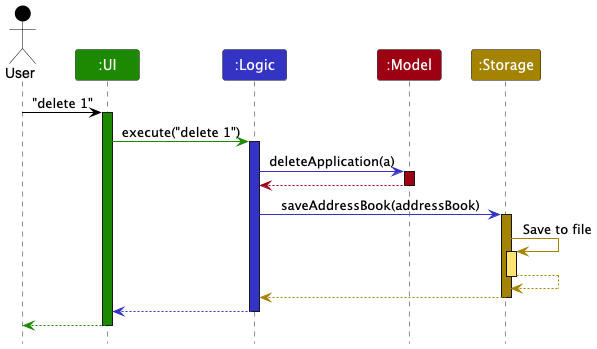

Each of the four main components (also shown in the diagram above),

* defines its *API* in an `interface` with the same name as the Component.
* implements its functionality using a concrete `{Component Name}Manager` class (which follows the corresponding API `interface` mentioned in the previous point.

For example, the `Logic` component defines its API in the `Logic.java` interface and implements its functionality using the `LogicManager.java` class which follows the `Logic` interface. Other components interact with a given component through its interface rather than the concrete class (reason: to prevent outside component's being coupled to the implementation of a component), as illustrated in the (partial) class diagram below.

The sections below give more details of each component.

### UI component

The **API** of this component is specified in [`Ui.java`](https://github.com/se-edu/addressbook-level3/tree/master/src/main/java/seedu/address/ui/Ui.java)

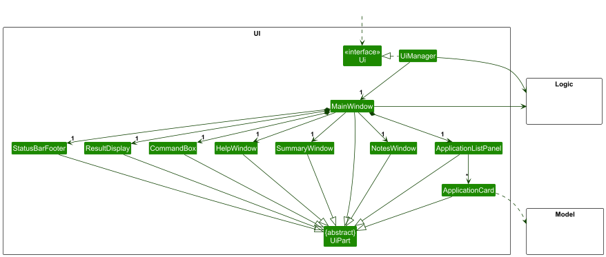

The UI consists of a `MainWindow` that is made up of parts such as `CommandBox`, `ResultDisplay`,
`ApplicationListPanel`, `StatusBarFooter`, `HelpWindow`, `NotesWindow`, and `SummaryWindow`.
All these, including the `MainWindow`, inherit from the abstract `UiPart` class which captures the
commonalities between classes that represent parts of the visible GUI.

The `UI` component uses the JavaFx UI framework. The layout of these UI parts are defined in matching `.fxml` files that are in the `src/main/resources/view` folder. For example, the layout of the [`MainWindow`](https://github.com/se-edu/addressbook-level3/tree/master/src/main/java/seedu/address/ui/MainWindow.java) is specified in [`MainWindow.fxml`](https://github.com/se-edu/addressbook-level3/tree/master/src/main/resources/view/MainWindow.fxml)

The `UI` component,

* executes user commands using the `Logic` component.
* listens for changes to `Model` data so that the UI can be updated with the modified data.
* keeps a reference to the `Logic` component, because the `UI` relies on the `Logic` to execute commands.
* depends on some classes in the `Model` component, as it displays `Application` objects residing in the `Model`.
* responds to `UiAction` values returned in `CommandResult` to open secondary windows such as Help, Notes, and Summary.

`MainWindow` also binds keyboard accelerators for menu actions, e.g. `F1` for Help and `F2` for Summary.

### Logic component

**API** : [`Logic.java`](https://github.com/se-edu/addressbook-level3/tree/master/src/main/java/seedu/address/logic/Logic.java)

Here's a (partial) class diagram of the `Logic` component:

The sequence diagram below illustrates the interactions within the `Logic` component, taking `execute("delete 1")` API call as an example.

<strong>Note:</strong> The lifeline for <code>DeleteCommandParser</code> should end at the destroy marker (X) but due to a limitation of PlantUML, the lifeline continues till the end of diagram.

How the `Logic` component works:

1. When `Logic` is called upon to execute a command, it is passed to an `AddressBookParser` object which in turn creates a parser that matches the command (e.g., `DeleteCommandParser`) and uses it to parse the command.
1. This results in a `Command` object (more precisely, an object of one of its subclasses e.g., `DeleteCommand`) which is executed by the `LogicManager`.
1. The command can communicate with the `Model` when it is executed (e.g. to delete an application). 
   Note that although this is shown as a single step in the diagram above (for simplicity), in the code it can take several interactions (between the command object and the `Model`) to achieve.
1. The result of the command execution is encapsulated as a `CommandResult` object which is returned back from `Logic`.

Here are the other classes in `Logic` (omitted from the class diagram above) that are used for parsing a user command:

How the parsing works:
* When called upon to parse a user command, the `AddressBookParser` class creates an `XYZCommandParser` (`XYZ` is a placeholder for the specific command name e.g., `AddCommandParser`) which uses the other classes shown above to parse the user command and create a `XYZCommand` object (e.g., `AddCommand`) which the `AddressBookParser` returns back as a `Command` object.
* All `XYZCommandParser` classes (e.g., `AddCommandParser`, `DeleteCommandParser`, ...) inherit from the `Parser` interface so that they can be treated similarly where possible e.g, during testing.

### Model component
**API** : [`Model.java`](https://github.com/se-edu/addressbook-level3/tree/master/src/main/java/seedu/address/model/Model.java)

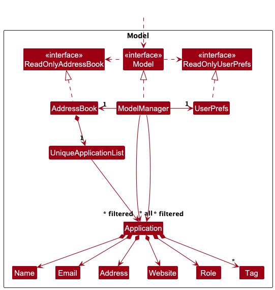

The `Model` component,

* stores HireME data i.e., all `Application` objects (which are contained in a `UniqueApplicationList` object).
* stores the currently displayed applications as a filtered list exposed as an unmodifiable `ObservableList<Application>` so that the UI updates automatically when the filtered list changes.
* stores a `UserPref` object that represents the user’s preferences. This is exposed to the outside as a `ReadOnlyUserPref` objects.
* stores the currently selected application for notes viewing/editing in `selectedNotesApplication`.
* does not depend on any of the other three components (as the `Model` represents data entities of the domain, they should make sense on their own without depending on other components)

An `Application` currently contains:

* identity fields: `companyName` and `role`
* required tracking fields: `date` and `status`
* optional reference fields: `email`, `website`, and `address`
* additional state fields: `notes`, `isArchived`, and `tags`

`Model` also defines commonly used predicates:

* `PREDICATE_SHOW_UNARCHIVED_APPLICATIONS`
* `PREDICATE_SHOW_ARCHIVED_APPLICATIONS`
* `PREDICATE_SHOW_ALL_APPLICATIONS`

`ModelManager` keeps track of the current predicate so that commands such as `edit` and `unarchive`
can refresh the list without unexpectedly changing the user’s current view.

### Storage component

**API** : [`Storage.java`](https://github.com/se-edu/addressbook-level3/tree/master/src/main/java/seedu/address/storage/Storage.java)

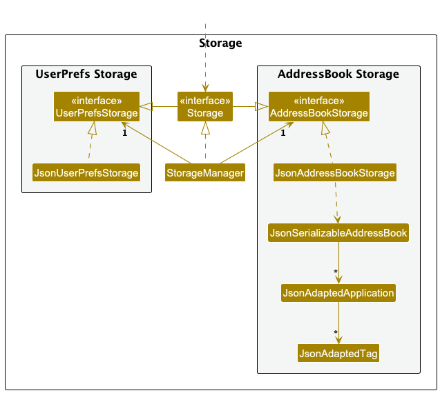

The `Storage` component,
* can save both application data and user preference data in JSON format, and read them back into corresponding objects.
* inherits from both `AddressBookStorage` and `UserPrefStorage`, which means it can be treated as either one (if only the functionality of only one is needed).
* depends on some classes in the `Model` component (because the `Storage` component's job is to save/retrieve objects that belong to the `Model`)

### Common classes

Classes used by multiple components are in the `seedu.address.commons` package.

--------------------------------------------------------------------------------------------------------------------

## **Implementation**

This section describes noteworthy implementation details of features that are currently present in HireME.

### Find feature

The `find` feature filters the displayed application list based on one or more user-provided search fields.

The sequence diagram below illustrates the interactions when the user executes `find n/google`:

`find` is implemented using `FindCommandParser`, `ApplicationMatchesPredicate`, and `FindCommand`:

* `AddressBookParser` delegates `find` input to `FindCommandParser`.
* `FindCommandParser` parses the supplied prefixed fields and constructs an `ApplicationMatchesPredicate`.
* `FindCommand` applies that matching condition through `Model#updateFilteredApplicationList(...)`.

### Archive state and filtered list views

Archive state is stored directly in `Application` as the boolean field `isArchived`.

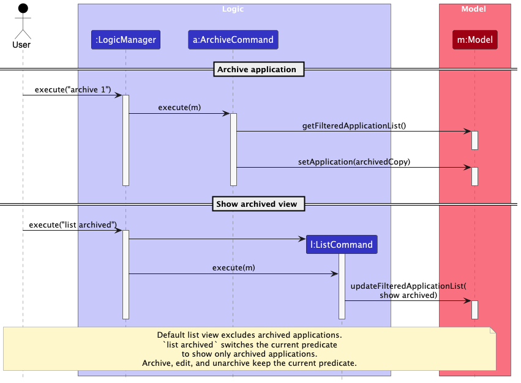

This affects multiple layers:

* `Application` stores the archive flag as part of the model state.
* `JsonAdaptedApplication` serializes `isArchived` to JSON and defaults missing values to `false` when reading older data files.
* `Model` exposes `PREDICATE_SHOW_UNARCHIVED_APPLICATIONS` and `PREDICATE_SHOW_ARCHIVED_APPLICATIONS`.
* `ModelManager` starts with the unarchived predicate by default, so archived applications are hidden from the normal view.

`list` and `list archived` are implemented by `ListCommand` and `ListCommandParser`:

* `list` applies `PREDICATE_SHOW_UNARCHIVED_APPLICATIONS`
* `list archived` applies `PREDICATE_SHOW_ARCHIVED_APPLICATIONS`

`archive INDEX` and `unarchive INDEX` replace the target `Application` with a new immutable `Application`
instance whose `isArchived` value is toggled. This keeps the implementation consistent with the rest of the model,
where edits are represented by replacing immutable objects rather than mutating them in place.

One important design detail is that `ModelManager` stores the current filter predicate. This allows commands such as
`edit`, `archive`, and `unarchive` to refresh the displayed list without accidentally resetting the current view.

### Notes window flow

HireME stores free-form notes directly in each `Application` using the `notes` field.

The notes feature is implemented using three cooperating pieces:

* `OpenCommand` selects an application from the currently displayed list and indicates whether notes should be shown
  in view mode or edit mode.
* `ModelManager` stores the selected application in `selectedNotesApplication`.
* `MainWindow` reacts to the `UiAction` in `CommandResult` and opens `NotesWindow` in the appropriate mode.

When the user saves notes from the notes window:

1. `NotesWindow` calls back into `Logic`.
2. `Logic` delegates to `Model#saveApplicationNotes`.
3. `ModelManager#saveApplicationNotes` creates a replacement `Application` with updated notes.
4. The replacement preserves the existing `isArchived` flag and other fields.

This design keeps the note editor out of the command parser while still preserving a single source of truth for
application data in the model.

### Summary window flow

The summary feature is implemented by `SummaryCommand`.

When `summary` is executed:

1. `SummaryCommand` retrieves all stored applications from the model.
2. It computes counts for active applications only (`Pending`, `Offered`, `Rejected`) and separately counts archived
   applications.
3. It returns a `CommandResult` with `UiAction.SHOW_SUMMARY`.
4. `MainWindow` opens or focuses `SummaryWindow` and passes the generated summary text to it.

`MainWindow` also listens for changes in the filtered application list and refreshes the summary window while it is
open. This keeps the summary display aligned with the latest in-memory data after commands modify HireME data.

### UI action dispatch

HireME uses `CommandResult` plus `UiAction` to decouple command execution from JavaFX window management.

Commands remain responsible for domain logic only:

* `HelpCommand` returns `UiAction.SHOW_HELP`
* `SummaryCommand` returns `UiAction.SHOW_SUMMARY`
* `OpenCommand` returns either `UiAction.SHOW_NOTE` or `UiAction.EDIT_NOTE`
* `ExitCommand` returns `UiAction.EXIT`

`MainWindow` interprets these actions and performs the actual UI work. This keeps command classes testable and avoids
coupling them directly to JavaFX classes such as `Stage`.

### \[Proposed\] Undo/redo feature

Undo/redo is not implemented in the current codebase yet, but it remains a possible future enhancement.
The following design is therefore a proposal rather than a description of existing behavior.

#### Proposed Implementation

The proposed undo/redo mechanism is facilitated by `VersionedAddressBook`. It extends `AddressBook` with an undo/redo
history, stored internally as an `addressBookStateList` and `currentStatePointer`. Additionally, it implements the
following operations:

* `VersionedAddressBook#commit()` - Saves the current HireME state in its history.
* `VersionedAddressBook#undo()` - Restores the previous HireME state from its history.
* `VersionedAddressBook#redo()` - Restores a previously undone HireME state from its history.

These operations are exposed in the `Model` interface as `Model#commitAddressBook()`,
`Model#undoAddressBook()` and `Model#redoAddressBook()` respectively.

Given below is an example usage scenario and how the undo/redo mechanism would behave at each step.

Step 1. The user launches the application for the first time. `VersionedAddressBook` is initialized with the initial
HireME state, and the `currentStatePointer` points to that single state.

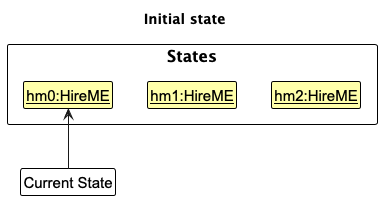

Step 2. The user executes `delete 5` to delete the 5th application in HireME. The `delete` command calls
`Model#commitAddressBook()`, causing the modified state after the command executes to be saved in
`addressBookStateList`, and the `currentStatePointer` is shifted to the newly inserted state.

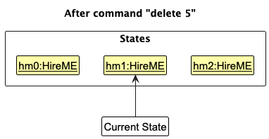

Step 3. The user executes `add n/David ...` to add a new application. The `add` command also calls
`Model#commitAddressBook()`, causing another modified state to be saved into `addressBookStateList`.

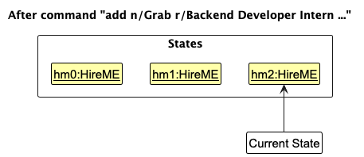

<strong>Note:</strong> If a command fails its execution, it will not call <code>Model#commitAddressBook()</code>, so the HireME state will not be saved into <code>addressBookStateList</code>.

Step 4. The user now decides that adding the application was a mistake, and decides to undo that action by executing
the `undo` command. The `undo` command calls `Model#undoAddressBook()`, which shifts the
`currentStatePointer` once to the left, pointing it to the previous state, and restores HireME to that state.

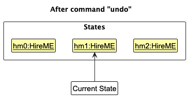

<strong>Note:</strong> If the <code>currentStatePointer</code> is at index 0, pointing to the initial state, then there are no previous states to restore. The <code>undo</code> command uses <code>Model#canUndoAddressBook()</code> to check if this is the case. If so, it returns an error to the user rather than attempting to perform the undo.

The following sequence diagram shows how an undo operation would go through the `Logic` component:

<strong>Note:</strong> The lifeline for <code>UndoCommand</code> should end at the destroy marker (X) but due to a limitation of PlantUML, the lifeline reaches the end of diagram.

Similarly, how an undo operation would go through the `Model` component is shown below:

The `redo` command does the opposite - it calls `Model#redoAddressBook()`, which shifts the
`currentStatePointer` once to the right, pointing to the previously undone state, and restores HireME to that state.

<strong>Note:</strong> If the <code>currentStatePointer</code> is at index <code>addressBookStateList.size() - 1</code>, pointing to the latest state, then there are no undone states to restore. The <code>redo</code> command uses <code>Model#canRedoAddressBook()</code> to check if this is the case. If so, it returns an error to the user rather than attempting to perform the redo.

Step 5. The user then decides to execute the command `list`. Commands that do not modify stored data, such as `list`,
would usually not call `Model#commitAddressBook()`, `Model#undoAddressBook()` or `Model#redoAddressBook()`. Thus,
`addressBookStateList` remains unchanged.

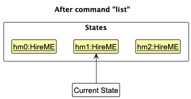

Step 6. The user executes `clear`, which calls `Model#commitAddressBook()`. Since `currentStatePointer` is not
pointing at the end of `addressBookStateList`, all states after `currentStatePointer` are purged. This matches the
behavior of many desktop applications where making a new change invalidates the redo chain.

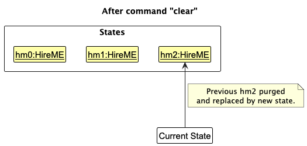

The following activity diagram summarizes what would happen when a user executes a new mutating command:

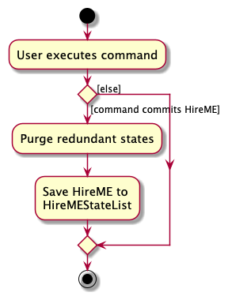

#### Design considerations

**Aspect: How undo & redo executes:**

* **Alternative 1 (current choice):** Save the entire state as snapshots.
  * Pros: Easy to implement and reason about.
  * Cons: May have performance issues in terms of memory usage.

* **Alternative 2:** Each command knows how to undo/redo itself.
  * Pros: Uses less memory in some cases, e.g. `delete` can store only the deleted application.
  * Cons: Every mutating command needs explicit undo/redo logic, which increases implementation complexity.

--------------------------------------------------------------------------------------------------------------------

## **Documentation, logging, testing, configuration, dev-ops**

* [Documentation guide](Documentation.md)
* [Testing guide](Testing.md)
* [Logging guide](Logging.md)
* [Configuration guide](Configuration.md)
* [DevOps guide](DevOps.md)

--------------------------------------------------------------------------------------------------------------------

## **Appendix: Requirements**

### Product scope

**Target user profile**:

* Is a Computer Science Student Looking for employment
* Has a need to manage a significant number of job applications at the same time
* Prefers a desktop application over a web application or spreadsheet for personal tracking of applications
* Can type fast and prefers keyboard interactions over mouse usage
* Is comfortable using command-line interfaces (CLI) and does not mind learning a new set of commands for efficient application management

**Value proposition**: 
HireME provides a convenient way to keep track of internship applications and current application status. 
Allow easy access to company information and contact details. 
Manage applications faster than a typical mouse/GUI driven app. 

### User stories

Priorities: High (must have) - `* * *`, Medium (nice to have) - `* *`, Low (unlikely to have) - `*`

| Priority  | As a … | I want to …                                                                           | So that I can…                                        |
|-----------|--------|---------------------------------------------------------------------------------------|-------------------------------------------------------|
| `* * *`   | user   | add new company information (name, email, website, address, etc.)                     | organise my internship applications in one place      |
| `* * *`   | user   | add an application status and application date                                        | track the progress of each internship application     |
| `* * *`   | user   | delete a company entry                                                                | remove applications that I no longer need             |
| `* * *`   | user   | update the status of a job application                                                | keep my application records accurate and up to date   |
| `* * *`   | user   | list all my job applications                                                          | easily monitor my overall application progress        |
| `* * *`   | user   | search for applications by fields such as company name, website, or application status | find relevant applications quickly                    |
| `* * *`   | user   | archive an application                                                                | hide inactive applications without losing the record  |
| `* * *`   | user   | unarchive an application                                                              | restore an archived application to active tracking    |
| `* * *`   | user   | open notes for an application                                                         | record or review interview and preparation details    |
| `* * *`   | user   | view a summary of my applications                                                     | understand my application progress at a glance        |
| `* * *`   | user   | view help information                                                                 | recall command formats when needed                    |
| `* *`     | user   | add tags to applications                                                              | group applications by interview stage or category     |
| `* *`     | user   | clear optional fields such as email, website, or address when editing                 | keep my records accurate when details change          |
| `* *`     | user   | search for applications using partial details                                         | avoid having to remember every application exactly   |
| `* *`     | user   | switch between active and archived application views                                  | review past applications without cluttering my list   |
| `* *`     | user   | open notes in view mode or edit mode                                                  | avoid accidental edits when I only want to review     |
| `*`       | user   | clear all applications at once                                                        | reset my tracker quickly when starting over           |
| `*`       | user   | access help and summary using keyboard shortcuts                                      | open supporting windows faster                        |
| `*`       | user   | have the app remember my window size and position                                     | continue from a familiar workspace each time          |

## Use cases

### UC01 - Add Application

**Main Success Scenario**:
1. User enters an add command with required parameters (company name, role, status, date).
2. HireME validates the input parameters.
3. HireME checks for duplicate applications.
4. HireME creates the new application.
5. HireME displays a success message.

Use case ends.

**Extensions**:

- 2a. Invalid parameter format detected.
  - 2a1. HireME detects invalid input (e.g., wrong date format, invalid email, invalid status).
  - 2a2. HireME displays an appropriate error message.
  - 2a3. No application is added. 
  - Use case ends.

- 3a. Duplicate application detected.
  - 3a1. HireME detects an existing application with the same Company Name and Role (case-insensitive).
  - 3a2. HireME displays error message: "This application already exists in the HireME."
  - 3a3. No application is added. 
  - Use case ends.

### UC02 - List applications

**Main success scenario**:
1. User enters list command to list applications.
2. HireME retrieves applications based on the requested view.
3. HireME displays the applications in the current list.
4. HireME displays a success message indicating the result of the listing operation.

Use case ends.

**Extensions**:
* 2a. User requests the default list view.
    * 2a1. HireME shows active (unarchived) applications only.
    * Use case resumes at step 3.
* 2b. User requests the archived list view.
    * 2b1. HireME shows archived applications only.
    * Use case resumes at step 3.
* 3a. There are no applications for the requested view.
    * 3a1. HireME shows an empty list and corresponding message.
    * Use case ends.

### UC03 - Delete application

**Precondition**: At least one application is shown in the current list

**Main success scenario**:
1. User enters delete command to delete an application by index.
2. HireME deletes the selected application.
3. HireME shows a success message.

Use case ends.

**Extensions**:
* 1a. The given index is invalid.
    * 1a1. HireME shows an error message.
    * Use case ends.

### UC04 - Edit Application

**Preconditions**: At least one application exists in HireME.

**Main Success Scenario**:
1. User lists applications.
2. HireME displays all stored applications.
3. User selects an application to update.
4. User specifies the new status for the application.
5. HireME validates the provided information.
6. HireME updates the application record and saves it.
Use case ends.

Extensions:

- 3a. The specified application does not exist.
  - 3a1. HireME informs the user that the application is invalid. Use case ends.

- 4a. The specified status is invalid.
  - 4a1. HireME informs the user of acceptable status values.
  Use case ends.

- *a. User cancels the operation at any time.
   Use case ends.

  
### UC05 - Find applications

**Precondition**: At least one application exists

**Main success scenario**:
1. User enters find command with one or more prefixed fields.
2. HireME applies the matching conditions to the stored applications.
3. HireME displays the applications that match the search criteria.
4. HireME shows the number of matching applications.

Use case ends.

**Extensions**:
* 1a. No search field is provided.
    * 1a1. HireME shows an error message.
    * Use case ends.
* 3a. No applications match the criteria.
    * 3a1. HireME shows an empty result list and corresponding feedback.
    * Use case ends.

### UC06 - Archive application

**Precondition**: At least one active application is shown in the current list

**Main success scenario**:
1. User enters archive command to archive an application by index.
2. HireME marks the selected application as archived.
3. HireME updates the displayed list.
4. HireME shows a success message.

Use case ends.

**Extensions**:
* 1a. The given index is invalid.
    * 1a1. HireME shows an error message.
    * Use case ends.

### UC07 - Unarchive application

**Precondition**: One or more archived applications are displayed

**Main success scenario**:
1. User lists archived applications.
2. HireME shows the archived applications.
3. User enters a command to unarchive an application by index.
4. HireME marks the selected application as no longer archived.
5. HireME shows a success message.

Use case ends.

**Extensions**:
* 3a. The given index is invalid.
    * 3a1. HireME shows an error message.
    * Use case ends.

### UC08 - Open application notes

**Precondition**: At least one application is shown in the current list

**Main success scenario**:
1. User enters open command to open an application's notes by index.
2. HireME identifies the selected application.
3. HireME opens the notes window in view mode or edit mode, depending on the command.
4. User reads or edits the notes.

Use case ends.

**Extensions**:
* 1a. The given index is invalid.
    * 1a1. HireME shows an error message.
    * Use case ends.

### UC09 - View summary

**Precondition**: None

**Main success scenario**:
1. User requests the application summary using the command or menu option.
2. HireME computes the relevant statistics.
3. HireME opens the summary window.
4. User reviews the summary information.

Use case ends.

### UC10 - Open Help

Main Success Scenario:
1. User requests to view help information (enters help).
2. HireME opens the help window.
3. HireME displays all available commands and their formats in the help window.
4. User reads the command formats to learn/recall how to use the system.
Use case ends.

---

## Non-Functional Requirements (NFRs)

### Usability
- A user who is comfortable with CLI should be able to complete core tasks (add, delete, edit, list) faster than using a mouse driven GUI.
- A new user should be able to learn the basic commands within 10 minutes using only the help command.
- Command formats shall follow a consistent prefix-based structure (e.g., n/, r/, s/) to ensure predictability.
- The system shall provide clear and specific error messages for invalid commands or parameters.
- Core tasks should be executable without requiring mouse interaction.

### Reliability
- Application data should be saved automatically after commands that modify stored data.
- Invalid user input should not cause the application to crash.

### Portability
- The application should work on Windows, macOS, and Linux with Java 17 or above installed.
- The application should not require an internet connection to function.
- The application should not depend on external services for core functionality.

### Maintainability
- The codebase shall pass the project's Checkstyle rules before each release.
- A developer who has completed the setup steps in this guide should be able to locate the main logic, model, storage,
  and UI packages by using the architecture and component diagrams in this guide.
- Each major feature shall have a User Guide section that states its command format, parameters, constraints, and at
  least one valid example.
- Each feature described in the Developer Guide's Implementation section shall identify the main implementation classes
  and explain the normal execution flow.

### Data Integrity
- The application should validate all user inputs and reject invalid data with clear error messages without crashing.

---

## Glossary

| Term                 | Definition                                                                     |
|----------------------|--------------------------------------------------------------------------------|
| Application          | A single job or internship application record stored in HireME                 |
| Active application   | An application that is not archived                                            |
| Archived application | An application kept in storage but hidden from the default list                |
| Notes                | Free-form text attached to an application for interview or tracking details    |
| Mainstream OS        | Windows, Linux, MacOS                                                          |
| Index                | The 1-based number shown beside an application in the currently displayed list |

--------------------------------------------------------------------------------------------------------------------

## **Appendix: Effort**

Relative to AB3, this project required moderate effort overall. The team reused the AB3 architecture, command
framework, storage layer structure, and much of the testing setup, which significantly reduced the baseline effort
needed to produce a working JavaFX application. However, substantial work was still required to reshape the product
from a generic contact manager into an internship-application tracker with domain-specific behavior.

The main implementation challenge was not the number of entity types, since HireME still centers around a primary
`Application` entity, but the amount of product-specific behavior added around that entity. Compared with AB3, the
project had to support application-specific fields such as `role`, `date`, `status`, `notes`, and archive state;
field-based filtering through `find`; secondary windows for help, notes, and summary; archived and unarchived list
views; and summary statistics that distinguish active applications from archived ones. These features required
coordinated changes across the model, parser, command, UI, storage, and test layers.

The most difficult parts were maintaining consistency across layers and removing inherited AB3 assumptions. A feature
such as archiving is not just a command change: it also affects model predicates, JSON serialization, UI rendering,
command semantics, and user/developer documentation. Similarly, the notes and summary features required explicit UI
action dispatch from commands through `CommandResult` into `MainWindow`, instead of staying within a simple
single-window list application.

Reuse from AB3 almost certainly accounts for well above 5% of the total project effort. In particular, the project
reused the overall component architecture, JavaFX application shell, parser-command structure, filtered-list model
pattern, JSON storage approach, and large parts of the test harness. That reuse reduced effort on infrastructure and
allowed more time to be spent on adapting the product to the internship-tracking domain. The effort in this project
therefore went primarily into adaptation and extension rather than building a desktop application framework from
scratch.

In terms of achievements, the project successfully transformed AB3 into a domain-specific product with a clearer user
workflow for internship tracking. The codebase now supports active versus archived application views, structured
application metadata, notes management, summary reporting, and HireME-specific documentation. The work is therefore
best understood as a meaningful product adaptation on top of AB3, rather than a cosmetic rename of the original code
base.

--------------------------------------------------------------------------------------------------------------------

## **Appendix: Instructions for manual testing**

Given below are instructions to test the app manually.

<strong>Note:</strong> These instructions only provide a starting point for testers to work on; testers are expected to do more <em>exploratory</em> testing.

### Launch and shutdown

1. Initial launch

   1. Download the jar file and copy into an empty folder

   2. Double-click the jar file to launch the app. 
       Expected: The app launches successfully and shows the main window.
   3. If the app fails to launch, open the terminal, use `cd` navigate to the folder containing the jar file, and use `java -jar HireME.jar` command to run the application.
   

2. Saving window preferences

   1. Resize the window to an optimum size. Move the window to a different location. Close the window.

   1. Re-launch the app by double-clicking the jar file. 
       Expected: The most recent window size and location is retained.

3. Closing the app
    1. Click the close button on the window.
    2. Run the `exit` command in the command box and press Enter.

    
### Adding an application

1. Test case:
   `add n/Google r/Frontend Engineer d/17-04-2026 s/Pending`  
    
    Expected:
   * A new application is added.
   * A success message containing the added application is shown.
   * The new application appears in the active list.

2. Test case:
   `add n/Google r/Frontend Engineer d/17-04-2026 s/Pending`  

    Expected:
   * No new application is added.
   * A duplicate application error is shown.

3. Test case:
   `add n/Grab r/Backend Intern d/31-02-2026 s/Pending`  

    Expected:
   * No application is added.
   * An error message is shown because the date is invalid.

4. Test case:
   `add n/Stripe r/Analyst d/20-04-2026 s/Waiting`  

    Expected:
   * No application is added.
   * An error message is shown because the status is invalid.

5. Test case:
   `add n/Meta r/Backend Intern d/20-04-2026 s/Pending e/not-an-email`  

    Expected:
   * No application is added.
   * An error message is shown because the email is invalid.

6. Test case:
   `add n/TikTok r/ML Engineer d/20-04-2026 s/Pending t/AI t/OA`  

    Expected:
   * A new application is added successfully with multiple tags.

### Listing applications

#### Listing active applications

1. Test case: `list`  

   Expected:
    * The app shows all active (unarchived) applications.
    * Archived applications, if any, are hidden. Details about archived applications in the later section.

2. Test case: `list abc`  

   Expected:
    * No list is changed.
    * An error message is shown.
   

### Deleting an application

1. Prerequisite: List all active applications using `list`. Ensure multiple applications are shown.

2. Test case: `delete 1`  
   Expected:
   * The first displayed application is deleted from the list.
   * A success message is shown.

3. Test case: `delete 0`  
   Expected:
   * No application is deleted.
   * An invalid index error is shown.

4. Other incorrect delete commands to try:
   `delete`
   `delete x`
     

    Expected:
   * Similar to the previous case: no application is deleted and an error message is shown.

### Editing an application

1. Prerequisite: Ensure at least one application exists in the current list.
2. Test case:
   `edit 1 s/Offered`  

    Expected:
   * The first displayed application is updated.
   * A success message is shown.

3. Test case:
   `edit 1 e/`  

    Expected:
   * The first displayed application's email is cleared.
   * A success message is shown.

4. Test case:
   `edit 1 t/`  

    Expected:
   * All tags of the first displayed application are removed.
   * A success message is shown.

5. Test case:
   `edit 0 s/Rejected`  

    Expected:
   * No application is edited.
   * An invalid index error is shown.

6. Test case:
   `edit 1`  

    Expected:
   * No application is edited.
   * An error message is shown because no fields were provided.

7. Test case:
   `edit 1 d/32-04-2026`  

    Expected:
   * No application is edited.
   * An error message is shown because the date is invalid.

### Finding applications

Use these test cases after ensuring that there are applications matching the relevant values.

1. Test case:
   `find n/google`  

    Expected:
   * Applications with company names containing `google` are shown.
   * Matching is case-insensitive.

2. Test case:
   `find s/Pending`  

    Expected:
   * Only applications with status `Pending` are shown.

3. Test case:
   `find n/google r/software`  

    Expected:
   * Only applications matching both company name and role are shown.

4. Test case:
   `find t/OA t/Fintech`  

    Expected:
   * Applications matching either tag are shown.

5. Test case:
   `find e/`  

    Expected:
   * Applications with no email are shown.

6. Test case:
   `find`  

    Expected:
   * No filtering is performed.
   * An error message is shown because at least one search field is required.

7. Test case:
   `find xyz`  

    Expected:
   * No filtering is performed.
   * An error message is shown because no valid prefixed field was provided.

### Archiving and unarchiving applications

#### Archiving an application

1. Prerequisite: List active applications using `list`.
2. Test case:
   `archive 1`  

    Expected:
   * The first displayed active application is archived.
   * It disappears from the default active list.
   * A success message is shown.

3. Test case:
   `archive 0`  

    Expected:
   * No application is archived.
   * An invalid index error is shown.

#### Viewing archived applications

1. Test case:
   `list archived`  

    Expected:
   * Archived applications are shown.

#### Unarchiving an application

1. Prerequisite: Archived applications are currently shown using `list archived`.
2. Test case:
   `unarchive 1`  

    Expected:
   * The first displayed archived application is restored to the active list.
   * A success message is shown.

3. Test case:
   `unarchive 0`  

    Expected:
   * No application is unarchived.
   * An invalid index error is shown.

### Opening application notes

1. Prerequisite: At least one application is shown in the current list.
2. Test case:
   `open 1`

Expected:
* A notes window opens in view-only mode for the first displayed application.

3. Test case:
   `open 1 m/true`

Expected:
* A notes window opens in edit mode for the first displayed application.

4. In the edit-mode notes window, enter some text such as:
   `Reached OA stage. Review graphs before interview.`

5. Save the notes, close the window, then run:
   `open 1`

Expected:
* The saved notes are shown in view-only mode.

6. Test case:
   `open 0`

Expected:
* No notes window is opened.
* An invalid index error is shown.

7. Test case:
   `open 1 m/yes`

Expected:
* No notes window is opened.
* An error message is shown because `m/` only accepts `true` or `false`.

### Viewing the summary

1. Test case:
   `summary`

Expected:
* A summary window opens.
* It shows:
    * total active applications
    * counts of `Pending`, `Offered`, and `Rejected`
    * success rate
    * number of archived applications

2. Test case:
   Press `F2`.

Expected:
* The same summary window is shown.

### Viewing help

1. Test case:
   `help`

Expected:
* A help window opens showing command formats and examples.

2. Test case:
   Press `F1`.

Expected:
* The help window opens.

### Clearing all entries

1. Prerequisite: Ensure that there are applications in the list.
2. Test case:
   `clear`

Expected:
* All applications are deleted.
* The list becomes empty.
* A success message is shown.

### Saving data

#### Data persistence

1. Add an application:
   `add n/TestCompany r/Test Role d/25-04-2026 s/Pending`
2. Close the app.
3. Launch the app again.  

    Expected:
   * The added application is still present.

#### Missing data file

1. Close the app.
2. Navigate to the app folder and delete `data/HireME.json`.
3. Launch the app again.  

    Expected:
   * The app starts normally.
   * Sample data is loaded.
