HireME helps you keep all your internship applications in one place, so you can easily track your progress.
If you type fast, you can complete your application listings faster with HireME than with mouse-based apps.

## Table of Contents

- <strong><a href="#quick-start">Quick Start</a></strong>

- <strong><a href="#features">Features</a></strong>
    - **[Managing](#managing-applications)**
        - [`add` — Adding an application](#adding-an-application-add)
        - [`edit` — Editing an application](#editing-an-application-edit)
        - [`delete` — Deleting an application](#deleting-an-application-delete)
        - [`list` — Listing all applications](#listing-all-applications-list)

    - **[Searching](#searching-applications)**
        - [`find` — Locating applications](#locating-applications-find)

    - **[Archiving](#archiving-applications)**
        - [`archive` — Archiving an application](#archiving-an-application-archive)
        - [`unarchive` — Unarchiving an application](#unarchiving-an-application-unarchive)

    - **[Notes](#application-notes)**
        - [`open` — Opening application notes](#opening-application-notes-open)

    - **[General Commands](#general-commands)**
        - [`summary` — Viewing application summary](#viewing-application-summary-summary)
        - [`help` — Viewing help](#viewing-help-help)
        - [`clear` — Clearing all entries](#clearing-all-entries-clear)
        - [`exit` — Exiting HireME](#exiting-hireme-exit)

- <strong><a href="#faq">FAQ</a></strong>
- <strong><a href="#known-issues">Known Issues</a></strong>
- <strong><a href="#command-summary">Command Summary</a></strong>
- <strong><a href="#glossary">Glossary</a></strong>

--------------------------------------------------------------------------------------------------------------------

## Quick start

Follow these steps to set up and start using HireME:
1. Ensure you have [Java 17](#java-17) or above installed in your Computer.

     >  **To check your Java Version:**
     > 
     > 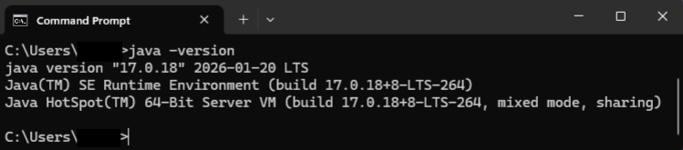
     >  1.   Open a terminal (Command Prompt on Windows / Terminal on Mac) and run:  
     >       `java -version`
     >         
     >       
     >       If Java is installed, you should see output like:
     >  
     >       `java version "17.x.x"`
     >     
     >     
     >  3. If Java is not installed or the version is not 17, you can follow installation guides [here](https://se-education.org/guides/tutorials/javaInstallation.html).
     > (Mac, Windows, Linux)

      
2. Download the latest `.jar` file from the [releases page](https://github.com/AY2526S2-CS2103T-W11-3/tp/releases).

    > You can find the latest release usually at the top of the page with a `Latest` tag.
    > 
    > 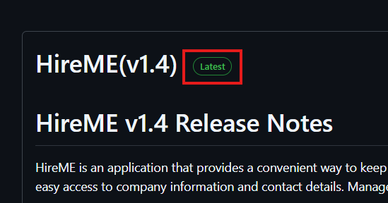

      
3. Create a new folder and name it. This would be the _home folder_ for HireME. Copy `HireME.jar` to the folder. 
   >Take note of the path of your home folder, you will need it when launching HireME
   > 
   >An example of a path: `C:\Users\your_username\Documents\your_folder_name`

     
4. Launch HireME by following the steps below:
   > 1. Open a terminal (Command Prompt on Windows / Terminal on Mac).
   >   
   > 2. Using the path to your _home folder_, Navigate to the folder where you saved HireME.jar. Use the `cd` command to change your directory. 
   >   
   >    `cd Documents\your_folder_name`
   >   
   > 3. To launch HireME, run the following command:
   >   
   >    `java -jar HireME.jar`

       
5.  A [GUI](#gui) similar to the below should appear in a few seconds. Note how the app contains some sample data.
      
  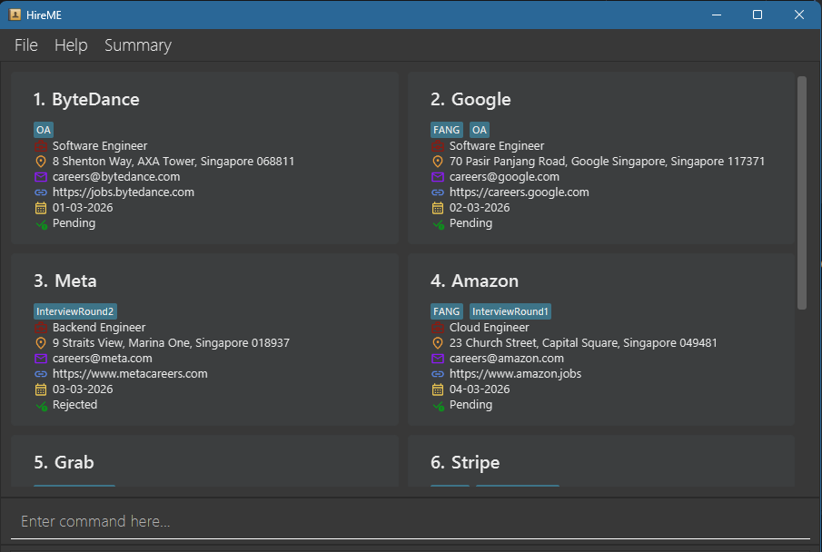
      
6. Type the command in the command box and press Enter to execute it. e.g. typing **`help`** and pressing Enter will open the help window. 
   >Some example commands you can try:
    >* `list` 
    >   
    >   Lists all applications.
    >  
    >* `add n/Grab r/Backend Developer Intern d/01-03-2026 s/Pending e/johnd@example.com w/https://johndoe.example.com a/311, Clementi Ave 2, #02-25 t/InterviewRound2 t/BigTech`
    >   
    >   Adds an application for `Grab` into HireME.
    >  
    >* `delete 3` 
    >  
    >   Deletes the 3rd application shown in the current list.
    >  
     >* `clear` 
     >  
     >   Deletes all applications.
     >  
     >* `exit` 
     >  
     >   Exits the app.
         
7. Refer to the [Features](#features) below for details of each command.

  

---
# Features
## Command Format Notes
**Notes about the command format:**
* Words in `UPPER_CASE` are the parameters to be supplied by the user. 
  e.g. in `add n/COMPANY_NAME`, `COMPANY_NAME` is a parameter which can be used as `add n/Google`.
    
* Items in square brackets are optional. 
  e.g. `n/COMPANY_NAME [e/EMAIL]` can be used as `n/Google e/hr@google.com` or as `n/Google`.
  A command may still require at least one item from a group of optional fields; follow the notes for each command.
    
* Items with `…`​ after them can be used multiple times including zero times. 
  e.g. `[t/TAG]…​` can be used as ` ` (i.e. 0 times), `t/tech`, `t/tech t/remote` etc.
    
* Parameters can be in any order. 
  e.g. if the command specifies `n/COMPANY_NAME r/ROLE`, `r/ROLE n/COMPANY_NAME` is also acceptable.
    
* Extraneous parameters for commands that do not take in parameters (such as `help`, `exit` and `clear`) will be ignored. 
  e.g. if the command specifies `help 123`, it will be interpreted as `help`.
    
* Each parameter (except tags) should only appear once in a command. If you accidentally provide duplicates (e.g. `n/Google n/Meta`), the app will flag an error.
    
> ⚠ **Warning:** If you are using a PDF version of this document, be careful when copying and pasting commands that span multiple lines as space characters surrounding line-breaks may be omitted when copied over to the application.

  

---

# Managing Applications
## Adding an application: `add`

Add a new application so you can keep track of where you have applied and what stage each application is at. Recording your applications early helps you avoid losing track follow-ups and important details such as contacts or job websites. You can also include tags to organise your applications and make them easier to find later.

#### Format: `add n/COMPANY_NAME r/ROLE d/DATE s/STATUS [e/EMAIL] [w/WEBSITE] [a/ADDRESS] [t/TAG]…​`
> 💡 **Tip:** See [Command Format Notes](#command-format-notes).

  
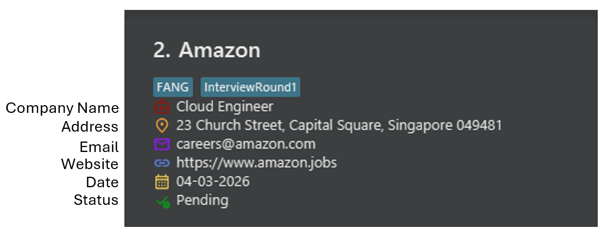
  

| Parameter    | Prefix | Required | Constraints                                 | Parameter Example       |
|--------------|--------|----------|---------------------------------------------|-------------------------|
| Company Name | `n/`   | Yes      | Alphanumeric characters and spaces only     | `n/Google`              |
| Role         | `r/`   | Yes      | Alphanumeric characters and spaces only     | `r/SWE Intern`          |
| Date         | `d/`   | Yes      | Must be in `DD-MM-YYYY` format              | `d/15-03-2026`          |
| Status       | `s/`   | Yes      | Must be `Offered`, `Pending`, or `Rejected` | `s/Pending`             |
| Email        | `e/`   | Optional | Must follow email format                    | `e/hr@google.com`       |
| Website      | `w/`   | Optional | Must follow website format                  | `w/https://google.com`  |
| Address      | `a/`   | Optional | Must not be blank                           | `a/Singapore`           |
| Tag          | `t/`   | Optional | Alphanumeric only, no spaces                | `t/govtech` `t/fintech` |

> ⚠ **Warning:** Two applications with the same `Company Name` and `Role` are not allowed. (Case-insensitive) 
> You can reuse either field as long as the other is different.

> ⚠ **Warning:** All tags must be unique, duplicated tags will be truncated to a single tag.

> 💡 **Tip:** An application can have any number of tags (including 0).

  
#### Valid Examples:
- `add n/Google r/Software Engineer d/15-03-2026 s/Pending`  
  Adds a new application to Google. Note that this `add` command **excluded all optional fields**.
  
- `add n/Grab r/Backend Developer Intern e/careers@grab.com w/https://grab.com/careers a/3 Media Close d/01-03-2026 s/Pending t/tech t/startup`

  Adds an application with tags for easier filtering later. Note that this `add` command is **not in order**.
  

---
## Editing an application: `edit`

Edits an existing application in HireME. Use this when you need to update details like a new status or correct a mistake.

#### Format: `edit INDEX FIELD [FIELD]…​`
> 💡 **Tip:** See [Command Format Notes](#command-format-notes).

`FIELD` can be any of: `n/COMPANY_NAME`, `r/ROLE`, `d/DATE`, `s/STATUS`, `e/EMAIL`, `w/WEBSITE`, `a/ADDRESS`, or `t/TAG`.

  

| Parameter    | Prefix | Required | Constraints                                                              | Result                         |
|--------------|--------|----------|--------------------------------------------------------------------------|--------------------------------|
| Index        | —      | Yes      | Must be a positive integer and within the bounds of the current list     | Edits the position in the list |
| Company Name | `n/`   | Optional | Cannot be empty                                                          | Updated company name           |
| Role         | `r/`   | Optional | Cannot be empty                                                          | Updated job role               |
| Date         | `d/`   | Optional | Must be in DD-MM-YYYY format                                             | Updated application date       |
| Status       | `s/`   | Optional | Must be Offered, Pending, or Rejected                                    | Updated application status     |
| Email        | `e/`   | Optional | Must follow email format,  _Leave this blank to clear the field_     | Updated email                  |
| Website      | `w/`   | Optional | Must follow website format,  _Leave this blank to clear the field_   | Updated job link               |
| Address      | `a/`   | Optional | _Leave this blank to clear the field_                                    | Updated company location       |
| Tag          | `t/`   | Optional | Alphanumeric only, no spaces,  _Leave this blank to clear the field_ | Replaces all existing tags     |

> ⚠ **Warning:** At least **ONE** field must be provided after `INDEX`. Entering `edit INDEX` by itself is invalid.

> ⚠ **Warning:** Existing values will be **overwritten** by the input values. When editing tags, the existing tags of the application will be **replaced entirely** — editing tags is not cumulative

  
#### Valid Examples:
*  `edit 1 s/Offered` 

    Updates the status of the 1st application to `Offered`. Congrats!
     

*  `edit 2 r/Backend Developer Intern e/johndoe@example.com` 

   Edits the role and email of the 2nd application.
     

*  `edit 3 t/` 

   Clears all existing tags from the 3rd application.

  

---

## Deleting an application: `delete`

Delete an application you no longer need from HireME.

#### Format: `delete INDEX`
> 💡 **Tip:** See [Command Format Notes](#command-format-notes).

  

| Parameter | Prefix | Required | Constraints                                                          | Result                                         | Example |
|-----------|--------|----------|----------------------------------------------------------------------|------------------------------------------------|---------|
| Index     | —      | Yes      | Must be a positive integer and within the bounds of the current list | Deletes the application at the specified index | `1`     |

> ⚠ **Warning:** Deleting an application is irreversible. The command does not come with a confirmation message.

> 💡 **Tip:** The index refers to the index number shown in the displayed list. The [`list` command](#listing-all-applications--list) and [`find` command](#locating-applications-find) can modify the displayed list.

  
#### Valid Examples:
* `list` followed by `delete 2` 

Deletes the 2nd application in the list.
  

* `find n/Google` followed by `delete 1` 

Deletes the 1st application in the results of the `find` command.

  

---

## Listing all applications: `list`

View all your applications currently stored in HireME.

#### Format: `list [archived]`
> 💡 **Tip:** See [Command Format Notes](#command-format-notes).

  

| Parameter | Prefix | Required | Result                                         | Full Command    |
|-----------|--------|----------|------------------------------------------------|-----------------|
| (blank)   | —      | —        | Shows all **active (unarchived)** applications | `list`          |
| archived  | —      | Optional | Shows all **archived** applications            | `list archived` |

> 💡 **Tip:** The displayed list affects all commands that uses Index.
>

  

---
# Searching Applications

## Locating applications: `find`

Search for applications by entering keywords (e.g. company, role, or status) to quickly locate what you need.

#### Format: `find FIELD [FIELD]…​`
> 💡 **Tip:** See [Command Format Notes](#command-format-notes).

`FIELD` can be any of: `n/NAME`, `r/ROLE`, `d/DATE`, `s/STATUS`, `e/EMAIL`, `w/WEBSITE`, `a/ADDRESS`, or `t/TAG`.

  

| Parameter    | Prefix | Required | Result                                              | Example                |
|--------------|--------|----------|-----------------------------------------------------|------------------------|
| Company Name | `n/`   | Optional | Matches applications with similar company names     | `n/Google`             |
| Role         | `r/`   | Optional | Matches applications with similar roles             | `r/SWE Intern`         |
| Date         | `d/`   | Optional | Matches applications with the same date             | `d/15-03-2026`         |
| Status       | `s/`   | Optional | Matches applications with the specified status      | `s/Offered`            |
| Email        | `e/`   | Optional | Matches applications with similar email             | `e/hr@google.com`      |
| Website      | `w/`   | Optional | Matches applications with similar website           | `w/https://google.com` |
| Address      | `a/`   | Optional | Matches applications with similar address           | `a/Singapore`          |
| Tag          | `t/`   | Optional | Matches applications with any of the specified tags | `t/tech`               |

> ⚠ **Warning:** At least **ONE** field must be provided. Entering `find` by itself is invalid.

> 💡 **Tip:** Archived Applications **WILL BE INCLUDED** in the find command.

  

#### Special search behaviours:

| Pattern                   | Input Example            | Result                                                |
|---------------------------|--------------------------|-------------------------------------------------------|
| Empty compulsory field    | `find n/`                | Returns all applications (no filtering applied)       |
| Empty optional field      | `find e/`                | Returns applications with no email                    |
| Case-insensitive search   | `find n/google`          | Matches `Google`                                      |
| Partial match (substring) | `find n/Goog`            | Matches `Google`                                      |
| Invalid partial match     | `find n/Gogle`           | No match found                                        |
| Multiple different fields | `find n/Google r/Intern` | Matches applications that satisfy **both** conditions |
| Multiple tags             | `find t/tech t/fintech`  | Matches applications with **either** tag              |
| Missing prefix            | `find Google s/Pending`  | `Google` is ignored; only `s/Pending` is applied      |

> ⚠  **Warning:** Duplicate parameters that are not `tags` will only match the last value. To read more, [click here](#troubleshooting---find)

   
#### Valid Examples:
* `find n/google`

  Returns applications with company names containing "google"
    

* `find r/intern s/Pending`

  Returns applications with role containing "intern" and status containing "Pending"
    

* `find e/gmail`

  Returns applications with email containing "gmail"
    

* `find e/`

  Returns applications that have no email
    

* `find t/oa t/fintech`

  Returns applications tagged with either "oa" or "fintech"

  
An example of a filtered list is shown below:

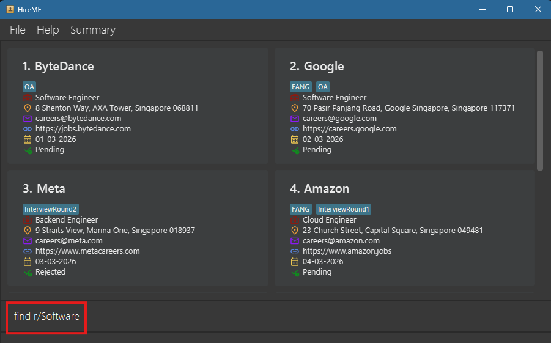

 

 Applications with roles matching "Software" is listed.

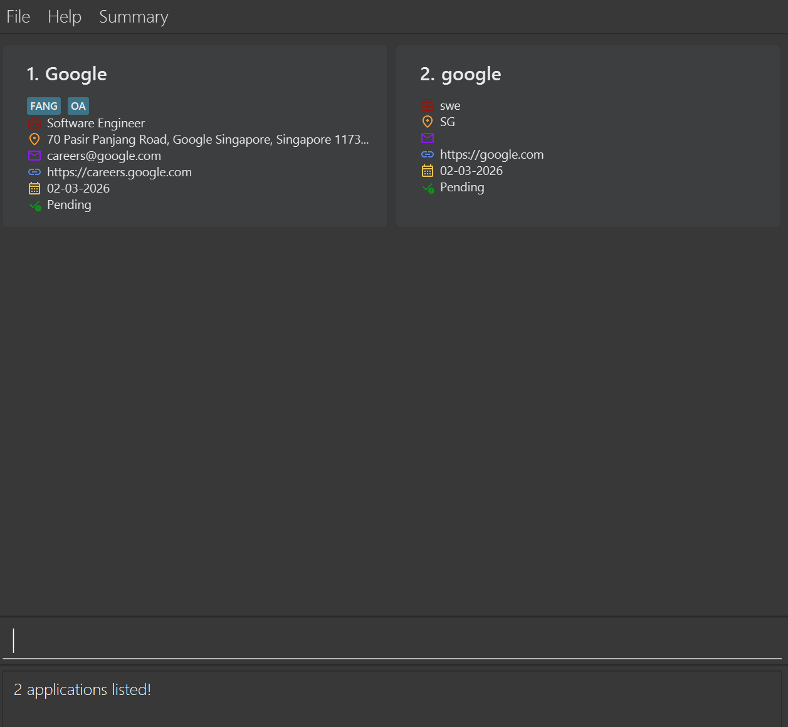

#### Troubleshooting - Find

| Scenario                | Input Example                     | Result                                      |
|-------------------------|-----------------------------------|---------------------------------------------|
| Missing prefix at start | `find Grab s/Pending`             | `Grab` is ignored. Only `s/Pending` is used |
| Missing prefix later    | `find n/Google Software Engineer` | Entire phrase treated as company name       |
| Repeated prefix         | `find n/Grab n/Google`            | Only last value (`Google`) is used          |

> 💡 **Tip:** For the Repeated prefix scenario, this issue does **not** apply to the tag prefix `t/`. See [Special search behaviours, Multiple tags](#special-search-behaviours)

  

---

# Archiving Applications

## Archiving an application: `archive`

Archive an application to remove it from your main list while keeping it available for future reference.

#### Format: `archive INDEX`
> 💡 **Tip:** See [Command Format Notes](#command-format-notes).

  
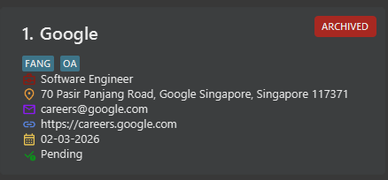
  

| Parameter | Prefix | Required | Constraints                                                          | Result                                          | Example |
|-----------|--------|----------|----------------------------------------------------------------------|-------------------------------------------------|---------|
| Index     | —      | Yes      | Must be a positive integer and within the bounds of the current list | Archives the application at the specified index | `1`     |

> 💡 **Tip:** Archiving an application does not delete it. It sets the application as archived and hides it from the main list.

> 💡 **Tip:** You can view archived applications using the [`list archived` command](#listing-all-applications--list).

  

#### Valid Examples:
* `archive 2` 

  Archives the 2nd application in the current list.
    
* `find n/Google` followed by `archive 1` 

  Archives the 1st application that has Google in the company name.

  

---

## Unarchiving an application: `unarchive`

Move an archived application back to your main list so you can continue tracking it.

#### Format: `unarchive INDEX`
> 💡 **Tip:** See [Command Format Notes](#command-format-notes).

  

| Parameter | Prefix | Required | Constraints                                                          | Result                                            | Example |
|-----------|--------|----------|----------------------------------------------------------------------|---------------------------------------------------|---------|
| Index     | —      | Yes      | Must be a positive integer and within the bounds of the current list | Unarchives the application at the specified index | `1`     |

> 💡 **Tip:** This command will only work on archived applications. See how to display archived applications [here](#listing-all-applications--list).

  
#### Valid Examples:

*  `list archived` followed by `unarchive 2` 

  Restores the 2nd archived application.

  

---

# Application Notes
## Opening application notes: `open`

Open or update an application's notes to review  important details from your application process.

#### Format: `open INDEX [m/CHOICE_OF_EDIT]`
> 💡 **Tip:** See [Command Format Notes](#command-format-notes).

  

| Parameter | Prefix  | Required | Constraints                                                          | Result                                                                             | Full Example     |
|-----------|---------|----------|----------------------------------------------------------------------|------------------------------------------------------------------------------------|------------------|
| Index     | —       | Yes      | Must be a positive integer and within the bounds of the current list | Opens the notes for the application at the specified index (Defaults to View Mode) | `open 1`         |
| View mode | m/False | Optional | m/ is **case-sensitive**. `False` is **case-insensitive**.           | Opens the notes in view mode                                                       | `open 1 m/False` |
| Edit Mode | m/True  | Optional | m/ is **case-sensitive**. `True` is **case-insensitive**.            | Opens the notes in edit mode                                                       | `open 1 m/True`  |

> 💡 **Tip:** If the mode is omitted, the open command defaults to view mode. E.g. `open 1` opens the notes of the 1st application in view mode.

#### Notes in View Mode: `open INDEX m/False`
The Notes window will pop up, showing your notes for the application at the specified index. You are unable to edit or save the notes in this mode.

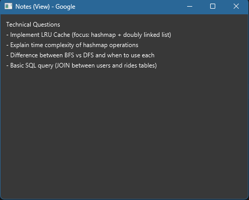
  
#### Notes in Edit Mode: `open INDEX m/True`
The Notes window will pop up, showing your notes for the application at the specified index. You are able to modify your notes in this mode. The changes will only be saved if you click the **_'Save'_** button.

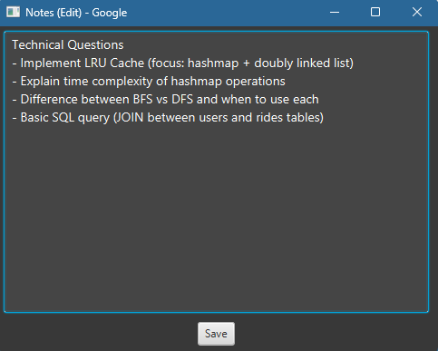

#### Valid Examples:
* `open 1` 

  Opens the notes for the 1st application in view-only mode.
  

* `open 2 m/True` 

  Opens the notes for the 2nd application in edit mode.
    

#### Troubleshoot - Notes
If an application is deleted with the Notes window open, your notes for the nonexistent application will not save.
The **_'Save'_** button will indicate a warning notification that the notes window failed to save and will **automatically close shortly after**.

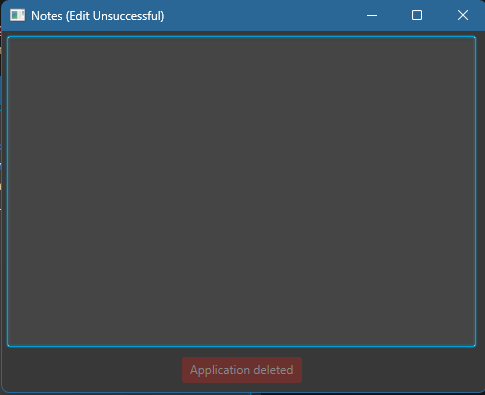

  

---
# General Commands
## Viewing application summary: `summary`

See an overview of your job applications and track your progress at a glance in a pop-up window.

#### Format: `summary`

> 💡 **Tip:** you can also open the same Summary window from the `Summary` menu or with the keyboard shortcut `F2`.

  

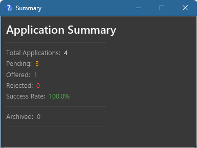

 

| Field              | What it shows                                                                             |
|--------------------|-------------------------------------------------------------------------------------------|
| Total Applications | Total number of active (non-archived) applications                                        |
| Pending            | Number of pending applications                                                            |
| Offered            | Number of offered applications                                                            |
| Rejected           | Number of rejected applications                                                           |
| Success Rate       | Percentage of applications that resulted in an offer (Excludes Archived Applications) |
| Archived           | Number of applications that have been archived                                            |

  

---

## Viewing help: `help`

Don't remember a command? No worries — `help` opens a window with a quick reference of all available commands and their formats.
#### Format: `help`
> 💡 Tip: You can also open the same help window from the `Help` menu or with the keyboard shortcut `F1`.

  

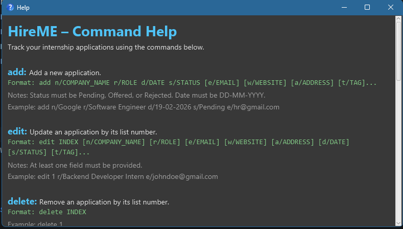

  

---
## Clearing all entries: `clear`

Clears all application entries from HireME. Useful if you want a fresh start (e.g. new internship cycle).

#### Format: `clear`

> ⚠ **Warning:**
> This action is irreversible. All your application data **including archived applications** will be permanently deleted.

  

---
## Exiting HireME: `exit`

Exits the program.

#### Format: `exit`
  

---
## Saving the data

HireME data is saved to your hard disk automatically after any command that changes the data. There is no need to save manually.
  

---
## Editing the data file

HireME data is saved automatically as a JSON file `[JAR file location]/data/HireME.json`. Advanced users are welcome to update data directly by editing that data file.

> ⚠ **Warning:**
> If your changes to the data file make its format invalid, HireME will discard all data and start with an empty data file at the next run. It is recommended to take a backup of the file before editing it. Furthermore, certain edits can cause HireME to behave in unexpected ways (e.g., if a value entered is outside the acceptable range). Only edit the data file if you are confident you can update it correctly.

  

--------------------------------------------------------------------------------------------------------------------

## FAQ

**Q: How do I transfer my data to another Computer? **
**A**: Install HireME on the other computer and overwrite the empty data file it creates with the file that contains the data from your previous HireME home folder.

**Q**: Can I add two applications to the same company? 
**A**: Yes, as long as the **role** and/or **company name** is different. They are case-insensitive so `Grab` and `grab` are considered the same company name. HireME identifies duplicates by the combination of company name and role.

**Q: Is the email field mandatory? **
**A**: No, email is optional. You can always add it later with the `edit` command.

**Q: What statuses can I use? **
**A**: The three supported statuses are `Offered`, `Pending`, and `Rejected`. They are case-insensitive, so `pending`, `PENDING`, and `Pending` all work.

**Q: Why does my `find` command not return expected results?**  
**A:** Ensure that:
- you are using prefixes (e.g. `n/Google`)
- the spelling matches
- you are not missing prefixes (text without prefixes is ignored)

**Q: Why does only one value get used when I repeat a prefix in `find`?**  
**A:** If the same prefix is used multiple times, only the **last value** is applied.  
Example: `find n/Grab n/Google` searches only for `Google`.

**Q: How do I view archived applications?**  
**A:** Use the command `list archived` to display all archived applications.

**Q: Why is my application not appearing after I add it?**  
**A:** Check if:
- you are viewing a filtered list (use `list` to reset)
- the application was archived

**Q: How is the success rate calculated?**  
**A:** It is based on applications with a final outcome (`Offered` or `Rejected`). Specifically `Offered` over the total number of `Offered` and `Rejected` outcomes. Archived applications are excluded.

**Q: Can I edit multiple fields at once?**  
**A:** Yes. You can include multiple prefixes in a single `edit` command to update several fields at once.

  

--------------------------------------------------------------------------------------------------------------------

## Known issues

1. **When using multiple screens**, if you move the application to a secondary screen, and later switch to using only the primary screen, the GUI will open off-screen. The remedy is to delete the `preferences.json` file created by the application before running the application again.
2. **If you minimize the Help Window** and then run the `help` command (or use the `Help` menu, or the keyboard shortcut `F1`) again, the original Help Window will remain minimized, and no new Help Window will appear. The remedy is to manually restore the minimized Help Window.
3. **If you use the same prefix multiple times** in the `find` command (e.g. `n/Grab n/Google`), only the last value is used. The remedy is to use different prefixes or run separate searches instead.

  

--------------------------------------------------------------------------------------------------------------------

## Command summary

| Action                                                  | Format                                                                                                 | Example                                                                                                             |
|---------------------------------------------------------|--------------------------------------------------------------------------------------------------------|---------------------------------------------------------------------------------------------------------------------|
| [**Add**](#adding-an-application-add)                   | `add n/COMPANY_NAME r/ROLE d/DATE s/STATUS [e/EMAIL] [w/WEBSITE] [a/ADDRESS] [t/TAG]…​`                | `add n/Google r/Software Engineer d/15-03-2026 s/Pending t/tech` w/https://careers.google.com a/70 Pasir Panjang Rd |
| [**Edit***](#editing-an-application--edit)              | `edit INDEX FIELD [FIELD]…​`                                                                           | `edit 1 s/Offered`                                                                                                  |
| [**Delete**](#deleting-an-application--delete)          | `delete INDEX`                                                                                         | `delete 3`                                                                                                          |
| [**List**](#listing-all-applications--list)             | `list [archived]`                                                                                      | —                                                                                                                   |
| [**Find***](#locating-applications-find)                | `find FIELD [FIELD]…​`                                                                                 | `find n/Google`                                                                                                     |
| [**Archive**](#archiving-an-application--archive)       | `archive INDEX`                                                                                        | `archive 2`                                                                                                         |
| [**Unarchive**](#unarchiving-an-application--unarchive) | `unarchive INDEX`                                                                                      | `unarchive 1`                                                                                                       |
| [**Open**](#opening-application-notes--open)            | `open INDEX m/[CHOICE_OF_EDIT]`                                                                        | `open 1 m/True`                                                                                                     |
| [**Summary**](#viewing-application-summary--summary)    | `summary`                                                                                              | —                                                                                                                   |
| [**Help**](#viewing-help--help)                         | `help`                                                                                                 | —                                                                                                                   |
| [**Clear**](#clearing-all-entries--clear)               | `clear`                                                                                                | —                                                                                                                   |
| [**Exit**](#exiting-hireme--exit)                       | `exit`                                                                                                 | —                                                                                                                   |

> ⚠ **Warning:** At least **ONE** optional field is required for the `edit` command. At least **ONE** search field is required for the `find` command.

--------------------------------------------------------------------------------------------------------------------

## Glossary
[Back to Table of Contents](#table-of-contents)

### Java 17
A version of Java required to run HireME. It provides the environment that allows your computer to open and run the application.

### GUI
Graphical User Interface — the visual interface of the app (windows, buttons, panels).

### Index 
The position number of an application in the displayed list.

### Application Status
The current stage of an application (`Pending`, `Rejected`, or `Offered`).

### Date
The date entered using the `d/` prefix. It is typically used as the application date, but you can use it for any
date that is useful for tracking the application. Dates must use the `DD-MM-YYYY` format, such as `15-03-2026`.

### Tag
A label used to organise applications (e.g. `remote`, `tech`, `archived`).

### Field
A category of information in a command, such as `n/NAME` or `r/ROLE`.

### Prefix
A short label (e.g. `n/`, `r/`, `t/`) used to indicate the type of information being entered.

### Keyword
The value entered after a prefix.  
For example, in `n/Google`, `Google` is the keyword.
