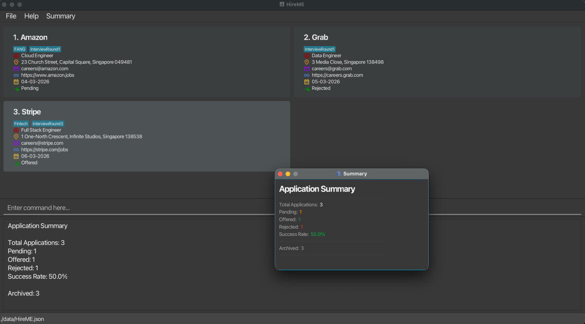
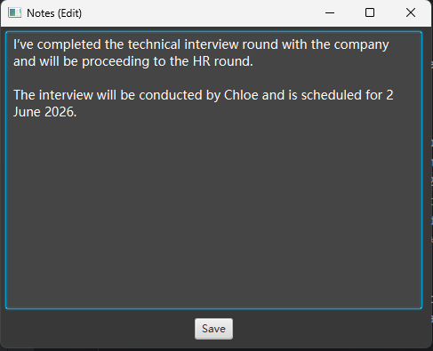

# User Guide

AddressBook Level 3 (AB3) is a desktop app for managing contacts, optimized for use via a Command Line Interface (CLI) while still having the benefits of a Graphical User Interface (GUI). If you can type fast, AB3 can get your contact management tasks done faster than traditional GUI apps.

* Table of Contents
  (Task for Daryl)

--------------------------------------------------------------------------------------------------------------------

## Quick start

1. Ensure you have Java `17` or above installed in your Computer. 
   **Mac users:** Ensure you have the precise JDK version prescribed [here](https://se-education.org/guides/tutorials/javaInstallationMac.html).

1. Download the latest `.jar` file from [here](https://github.com/se-edu/addressbook-level3/releases).

1. Copy the file to the folder you want to use as the _home folder_ for your AddressBook.

1. Open a command terminal, `cd` into the folder you put the jar file in, and use the `java -jar addressbook.jar` command to run the application. 
   A GUI similar to the below should appear in a few seconds. Note how the app contains some sample data. 
   

1. Type the command in the command box and press Enter to execute it. e.g. typing **`help`** and pressing Enter will open the help window. 
   Some example commands you can try:

   * `list` : Lists all contacts.

   * `add n/John Doe p/98765432 e/johnd@example.com a/John street, block 123, #01-01` : Adds a contact named `John Doe` to the Address Book.

   * `delete 3` : Deletes the 3rd contact shown in the current list.

   * `clear` : Deletes all contacts.

   * `exit` : Exits the app.

1. Refer to the [Features](#features) below for details of each command.

--------------------------------------------------------------------------------------------------------------------

## Features

 **Notes about the command format:**

* Words in `UPPER_CASE` are the parameters to be supplied by the user. 
      e.g. in `add n/COMPANY_NAME`, `COMPANY_NAME` is a parameter which can be used as `add n/Google`.
* Items in square brackets are optional. 
      e.g. `n/COMPANY_NAME [e/EMAIL]` can be used as `n/Google e/hr@google.com` or as `n/Google`.

* Items with `…`​ after them can be used multiple times including zero times. 
      e.g. `[t/TAG]…​` can be used as ` ` (i.e. 0 times), `t/tech`, `t/tech t/remote` etc.

* Parameters can be in any order. 
      e.g. if the command specifies `n/COMPANY_NAME r/ROLE`, `r/ROLE n/COMPANY_NAME` is also acceptable.

* Extraneous parameters for commands that do not take in parameters (such as `help`, `list`, `exit` and `clear`) will be ignored. 
      e.g. if the command specifies `help 123`, it will be interpreted as `help`.

* Each parameter (except tags) should only appear once in a command. If you accidentally provide duplicates (e.g. `n/Google n/Meta`), the app will flag an error.

* If you are using a PDF version of this document, be careful when copying and pasting commands that span multiple lines as space characters surrounding line-breaks may be omitted when copied over to the application.

### Viewing help : `help`

Don't remember a command? No worries — `help` opens a window with a quick reference of all available commands and their formats.

In addition, you can also open the same help window from the `Help` menu or with the keyboard shortcut `F1`.

Format: `help`

### Adding a application: `add`

Adds a new application to HireME.

**Parameter details:**

| Parameter | Prefix | Required | Constraints |
|-----------|--------|----------|-------------|
| Company Name | `n/` | Yes | Alphanumeric characters and spaces only |
| Role | `r/` | Yes | Alphanumeric characters and spaces only |
| Email | `e/` | No | Must follow `local-part@domain` format |
| Website | `w/` | Yes | Must be a valid website |
| Address | `a/` | Yes | Must not be blank |
| Date | `d/` | Yes | Must be in `DD-MM-YYYY` format |
| Status | `s/` | Yes | Must be `Offered`, `Pending`, or `Rejected` (case-insensitive) |
| Tag | `t/` | No | Alphanumeric only, no spaces. Can have multiple tags |

> [!TIP]
> An application can have any number of tags (including 0). Tags are handy for labelling things like `remote`, `onsite`, `highPriority`, etc.

> [!NOTE]
> Two applications are considered duplicates if they have the same **company name** and **role**. HireME will not allow you to add a duplicate.

Examples:
* `add n/Google r/Software Engineer w/https://careers.google.com a/70 Pasir Panjang Rd d/15-03-2026 s/Pending`
* `add n/Grab r/Backend Developer Intern e/careers@grab.com w/https://grab.com/careers a/3 Media Close d/01-03-2026 s/Pending t/tech t/startup`

### Listing all applications : `list`

Shows a list of all your applications in HireME.

Format: `list`

### Editing a application : `edit`

Edits an existing application in HireME. Use this when you need to update details like a new status or corrected information.

Format: `edit INDEX [n/COMPANY_NAME] [r/ROLE] [e/EMAIL] [w/WEBSITE] [a/ADDRESS] [d/DATE] [s/STATUS] [t/TAG]…​`

* Edits the application at the specified `INDEX`. The index refers to the index number shown in the displayed application list. The index **must be a positive integer** 1, 2, 3, …​
* At least one of the optional fields must be provided.
* Existing values will be overwritten by the input values.
* When editing tags, the existing tags of the application will be **replaced entirely** — editing tags is not cumulative.
* You can remove all the application's tags by typing `t/` without specifying any tags after it.

Examples:
*  `edit 1 s/Offered` Updates the status of the 1st application to `Offered`. Congrats!
*  `edit 2 r/Backend Developer Intern e/johndoe@example.com` Edits the role and email of the 2nd application.
*  `edit 3 t/` Clears all existing tags from the 3rd application.

---
### Locating applications: `find`

Finds applications that match the specified keywords.

Format: `find [n/NAME] [r/ROLE] [e/EMAIL] [w/WEBSITE] [a/ADDRESS] [d/DATE] [s/STATUS] [t/TAG]`

### 📖 Terminology
* **Field**: `n/NAME`, `r/ROLE`, `e/EMAIL`, `w/WEBSITE`, `a/ADDRESS`, `d/DATE`, `s/STATUS` and `t/TAG` are called fields.
* **Prefix**: `n/`, `r/`, `e/`, `w/`, `a/`, `d/`, `s/` and `t/` are called prefixes.
* **Keyword**: the text after the prefix is called keyword. 
  e.g. in `n/Google`, `Google` is the keyword.

 

### ⚠️ General Behaviour

* All fields (e.g. `n/NAME`, `r/ROLE`) are optional, but **at least one field must be provided**.

* The search is **case-insensitive**. 
  e.g `find n/google` matches `Google`.

* Partial matching is supported for all fields using **substring matching (not fuzzy matching)**.  
  e.g. `find n/Goog` matches `Google`,
  but `find n/Gogle` will NOT match `Google`

* Multiple **different** fields are combined using **AND** logic.
  e.g. `find n/Google r/Backend Developer` returns applications that match both name and role.

* For tags, multiple keywords are combined using **OR** logic.
  e.g. `find t/backend developer t/frontend developer` returns applications that match either tag.

* For optional fields (`email`, `website`, `address`): 
  Using an empty prefix (e.g. `e/`) matches applications with no value for that field.
  e.g. `find e/` returns applications that have no email.

### ⚠️ Important: Prefix-Based Filtering

Filtering is **only applied to keywords that are associated with a prefix**. 
`n/`, `r/`, `e/`, `w/`, `a/`, `d/`, `s/`, and `t/` are valid prefixes for filtering.

Any text **without a valid prefix will NOT be used for filtering**.

#### ❗ Missing prefix at the start of the command

`find Grab s/Pending`

* `s/Pending` → used for filtering (status)
* `Grab` → ignored (no prefix)

This behaves the same as:
`find s/Pending`

#### ❗ Missing prefix in the later part of the command

`find n/Google Software Engineer`

* Everything after `n/` is treated as the **name keyword**

Interpreted as:
`n/Google Software Engineer`

This searches for a company name containing:
`Google Software Engineer`

It will **NOT** treat `Software Engineer` as a role.

#### ❗ Repeated prefixes

If the same prefix is provided multiple times, **only the last occurrence will be used**.
Finding multiple applications with multiple keywords for the same field at the same time is not supported in this version.

e.g.  
`find n/google n/meta`

This will be interpreted as:

`find n/meta`

The earlier keyword (`google`) will be ignored.

### Examples:
* `find n/google`
  Returns applications with company names containing "google"

* `find r/intern s/applied`
  Returns applications with role containing "intern" and status containing "applied"

* `find e/gmail`
  Returns applications with email containing "gmail"

* `find e/`
  Returns applications that have no email

* `find t/oa t/fintech`
  Returns applications tagged with either "oa" or "fintech"

---
### Viewing archived applications

Displays all archived applications.

Format: `list archived`

* Shows all applications that are currently archived.
* You can use the `unarchive INDEX` command on this list to restore applications.

Example:
* `list archived`

### Deleting a application : `delete`

Deletes the specified application from HireME.

Format: `delete INDEX`

* Deletes the application at the specified `INDEX`.
* The index refers to the index number shown in the displayed application list.
* The index **must be a positive integer** 1, 2, 3, …​

Examples:
* `list` followed by `delete 2` deletes the 2nd application in the list.
* `find n/Google` followed by `delete 1` deletes the 1st application in the results of the `find` command.
### Archiving an application : `archive`

Archives the specified application so that it is hidden from the main list but still stored in the system.

Format: `archive INDEX`

* Archives the application at the specified `INDEX`.
* The index refers to the index number shown in the currently displayed application list.
* Archived applications will not appear in the normal `list` command.
* Archiving an application does not delete it. It sets the application as archived and hides it from the main list.
* You can view archived applications using the `list archived` command.
* The index **must be a positive integer** 1, 2, 3, …​

Examples:
* `archive 2` archives the 2nd application in the current list.
* `find Google` followed by `archive 1` archives the 1st application in the search results.

### Unarchiving an application : `unarchive`

Restores an archived application back to the main application list.

Format: `unarchive INDEX`

* The `INDEX` refers to the index number shown in the archived applications list.
* You must first view archived applications using `list archived` before using `unarchive`.
* The application will be removed from archived status and will appear in the normal list again.
* The index **must be a positive integer** 1, 2, 3, …​

Examples:
* `list archived`
* `unarchive 1` restores the 1st archived application.

### Viewing application summary : `Summary`

Displays a summary of your job application statistics in a pop-up window.

There are 2 ways to open the Application Summary:
1. **Command:** Type `summary` in the command box and press Enter.
2. **Menu bar:** Click `Summary` in the top menu bar.

Format: `summary`

* Shows the total number of active (non-archived) applications.
* Breaks down active applications by status: `Pending`, `Offered`, and `Rejected`.
* Calculates your `Success Rate`: the percentage of decided applications (Offered + Rejected) that resulted in an
offer. Displays `N/A` if no decisions have been made yet.
* Also shows the count of `Archived` applications separately.

Examples:
* `summary` opens the Summary window showing your application statistics.
* Clicking **Summary** in the menu bar opens the same Summary window.

### Opening application notes : `open`

Opens and displays the notes written during the internship application process for the specified application.

Format: `open INDEX [m/CHOICE_OF_EDIT]`

* Opens the notes for the application at the specified `INDEX`.
* The index refers to the index number shown in the displayed application list.
* The index **must be a positive integer** 1, 2, 3, …​
* `m/CHOICE_OF_EDIT` is optional. It must be `true` or `false`, and defaults to `false` if omitted.
* If `m/false` or omitted, the notes are opened in **view-only** mode.
* If `m/true`, the notes are opened in **edit** mode, allowing you to modify them.

Examples:
* `open 1` opens the notes for the 1st application in view-only mode.
* `open 2 m/true` opens the notes for the 2nd application in edit mode.

### Clearing all entries : `clear`

Clears all application entries from HireME. Useful if you want a fresh start (e.g. new internship cycle).

Format: `clear`

> [!CAUTION]
> This action is irreversible. All your application data will be permanently deleted.

### Exiting the program : `exit`

Exits the program.

Format: `exit`

### Saving the data

HireME data is saved to your hard disk automatically after any command that changes the data. There is no need to save manually.

### Editing the data file

HireME data is saved automatically as a JSON file `[JAR file location]/data/HireME.json`. Advanced users are welcome to update data directly by editing that data file.

> [!CAUTION]
> If your changes to the data file make its format invalid, HireME will discard all data and start with an empty data file at the next run. It is recommended to take a backup of the file before editing it. Furthermore, certain edits can cause HireME to behave in unexpected ways (e.g., if a value entered is outside the acceptable range). Only edit the data file if you are confident you can update it correctly.

--------------------------------------------------------------------------------------------------------------------

## FAQ

**Q**: How do I transfer my data to another Computer? 
**A**: Install HireME on the other computer and overwrite the empty data file it creates with the file that contains the data from your previous HireME home folder.

**Q**: Can I add two applications to the same company? 
**A**: Yes, as long as the **role** is different. HireME identifies duplicates by the combination of company name and role.

**Q**: Is the email field mandatory? 
**A**: No, email is optional. You can always add it later with the `edit` command.

**Q**: What statuses can I use? 
**A**: The three supported statuses are `Offered`, `Pending`, and `Rejected`. They are case-insensitive, so `pending`, `PENDING`, and `Pending` all work.

--------------------------------------------------------------------------------------------------------------------

## Known issues

1. **When using multiple screens**, if you move the application to a secondary screen, and later switch to using only the primary screen, the GUI will open off-screen. The remedy is to delete the `preferences.json` file created by the application before running the application again.
2. **If you minimize the Help Window** and then run the `help` command (or use the `Help` menu, or the keyboard shortcut `F1`) again, the original Help Window will remain minimized, and no new Help Window will appear. The remedy is to manually restore the minimized Help Window.

--------------------------------------------------------------------------------------------------------------------

## Command summary

| Action        | Format | Example |
|---------------|--------|-|
| **Add**       | `add n/COMPANY_NAME r/ROLE [e/EMAIL] w/WEBSITE a/ADDRESS d/DATE s/STATUS [t/TAG]…​` | `add n/Google r/Software Engineer w/https://careers.google.com a/70 Pasir Panjang Rd d/15-03-2026 s/Pending t/tech` |
| **Edit**      | `edit INDEX [n/COMPANY_NAME] [r/ROLE] [e/EMAIL] [w/WEBSITE] [a/ADDRESS] [d/DATE] [s/STATUS] [t/TAG]…​` | `edit 1 s/Offered` |
| **Delete**    | `delete INDEX` | `delete 3` |
| **Find**      | `find [n/NAME] [r/ROLE] [e/EMAIL] [w/WEBSITE] [a/ADDRESS] [d/DATE] [s/STATUS] [t/TAG]...` | `find n/Google` |
| **Archive**   | `archive INDEX` | `archive 2` |
| **Unarchive** | `unarchive INDEX` | `unarchive 1` |
| **List**      | `list` | |
| **Clear**     | `clear` | |
| **Help**      | `help` | |
| **Exit**      | `exit` | |
| **Summary**   | `summary` | |

--------------------------------------------------------------------------------------------------------------------

## Glossary

1. **CLI:** Command Line Interface
2. **GUI:** Graphical User Interface
3. **Index:** Position of an item in the displayed list
4. **Application Status:** Current stage of an internship application (`Pending`, `Rejected`, or `Offered`)
5. **Tag:** A label attached to an application for categorisation (e.g. `remote`, `tech`, `archived`)
